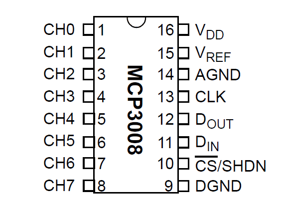

```{r, include = FALSE}
knitr::opts_chunk$set(
  collapse = TRUE,
  comment = "#>"
)
```

```{r setup}
library(rpigpior)
```

## GPIO Pinout

To run the unit tests on this package, you'll need to connect circuits to specific GPIO pins. Here's the pinout...

|     Connect to...      | Board Pin | Board Pin |     ...connects to      |
|:----------------------:|:---------:|:---------:|:-----------------------:|
|      bme 280 vcc       |     1     |     2     |                         |
|      bme 280 SDA       |     3     |     4     |                         |
|      bme 280 SCL       |     5     |     6     |                         |
|                        |     7     |     8     |                         |
|      bme 280 gnd       |     9     |    10     |                         |
|     rpi_set LED 3      |    11     |    12     |      rpi_pwm LED 1      |
|                        |    13     |    14     |                         |
|                        |    15     |    16     |                         |
|   3.3v to breadboard   |    17     |    18     |                         |
| mcp3008 spi0 mosi Din  |    19     |    20     |                         |
| mcp3008 spi0 miso Dout |    21     |    22     | mcp3008 spi chip select |
|   mcp3008 spi0 SCLK    |    23     |    24     |                         |
|                        |    25     |    26     |                         |
|                        |    26     |    28     |                         |
|                        |    29     |    30     |                         |
|                        |    31     |    32     |                         |
|     rpi_pwm LED 2      |    33     |    34     |                         |
|                        |    35     |    36     |                         |
|                        |    37     |    38     |                         |
|   gnd to breadboard    |    39     |    40     |     rpi_get pushbtn     |


